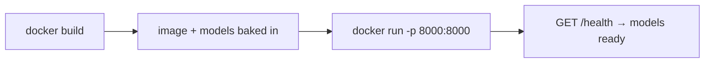
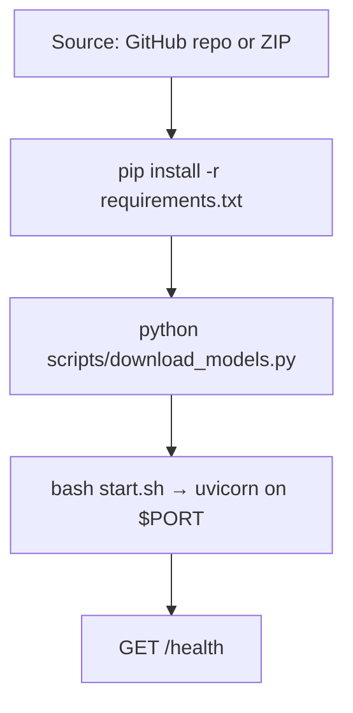

<div align="center">

# Deployment Guide — Apsides Voice API

**How to run the CPU-only voice backend on your own host — Docker, any Python PaaS/VPS, or a 2 GB free tier.**

[](README.md)
[](README.md#resource-footprint)
[](#1-docker-recommended)

</div>

---

## At a glance

| Requirement | Value |
| :--- | :--- |
| **Runtime** | Python 3.11–3.13 (3.12 image provided) |
| **Install command** | `pip install -r requirements.txt` |
| **Start command** | `bash start.sh` (or `uvicorn main:app --host 0.0.0.0 --port $PORT`) |
| **Health check** | `/health` (liveness) · `/ready` (readiness gate) |
| **Public ingress** | **Required** — an inbound HTTP port with `$PORT` injected |
| **Persistent storage** | **Recommended** — point `MODEL_DIR` at it (~303 MB of models) |
| **System packages** | **None** required (ffmpeg optional, for MP3/WebM uploads) |
| **RAM / CPU** | ~620 MB peak · 1–2 threads · fits a 2 GB / 1.5 vCPU host |

The app is a standard ASGI service, so it is **host-agnostic** — it only needs `$PORT` and a writable `MODEL_DIR`. It moves between the options below with **no code changes**.

---

## Table of Contents

- [1. Docker (recommended)](#1-docker-recommended)
- [2. Any Python host (PaaS / VPS)](#2-any-python-host-paas--vps)
- [3. Host walkthrough: Botkeep Founder Free](#3-host-walkthrough-botkeep-founder-free)
- [Model storage & persistence](#model-storage--persistence)
- [Expected resource use](#expected-resource-use)
- [Verify the deployment](#verify-the-deployment)
- [Public API endpoints](#public-api-endpoints)
- [Troubleshooting](#troubleshooting)
- [Switching STT backend](#switching-stt-backend)
- [Portable alternatives](#portable-alternatives)

---

## 1. Docker (recommended)

```bash
git clone https://github.com/apsideslabs/apsides-voice-api.git
cd apsides-voice-api
docker build -t apsides-voice-api .
docker run -p 8000:8000 -v "$PWD/models:/app/models" apsides-voice-api
```

The provided `Dockerfile` is based on `python:3.12-slim`, installs `ffmpeg` + `libsndfile1` + `ca-certificates`, and downloads the models at build time so the image is self-contained. Mount a volume at `/app/models` to persist them across restarts.



---

## 2. Any Python host (PaaS / VPS)



1. **Connect the repo** `apsideslabs/apsides-voice-api` (or upload a ZIP).
2. **Runtime:** Python. **Python version:** whatever the host provides — 3.11/3.12/3.13 all work.
3. **Install:** `pip install -r requirements.txt`
4. **Start:** `bash start.sh`

`start.sh` does the full sequence: download models if missing → locate `libtranscribe.so` and export `TRANSCRIBE_LIBRARY` → start uvicorn on `$PORT`.

If your host allows only a single start command, use this one line instead of `bash start.sh`:

```bash
python scripts/download_models.py && uvicorn main:app --host 0.0.0.0 --port ${PORT:-8000} --workers 1
```

### Required environment variables

Only these matter; the rest have safe defaults (see `.env.example`).

| Variable | Value | Why |
| :--- | :--- | :--- |
| `MODEL_DIR` | a **persistent** path, e.g. `/data/models` | Keeps ~303 MB of models from re-downloading every restart |
| `PORT` / `SERVER_PORT` | usually injected by the host | Bind port |
| `STT_BACKEND` | `transcribe_cpp` (default) | Uses the Q8_0 GGUF |
| `ONNX_NUM_THREADS` | `1` | Avoid CPU thrash on small hosts |
| `MAX_CONCURRENCY_TTS` / `_STT` | `1` | One job at a time on 2 GB RAM |
| `CORS_ORIGINS` | your site origins, comma-separated | Lock down who can call it |
| `API_KEY` | a secret you generate (`openssl rand -hex 32`) | Protect your compute |

Set secrets in the host's secret store — **never** commit them.

### System dependencies

**None.** The default backend needs no compiler and no system packages:

- `pip install -r requirements.txt` pulls in `transcribe-cpp` **and** `transcribe-cpp-native`, which bundles the prebuilt `libtranscribe.so` + ggml CPU kernels. Verified to load with only standard `glibc`/`libstdc++` present; the Vulkan module is optional and unused.
- **ffmpeg** is *optional* — install it only to accept MP3/WebM uploads. WAV/FLAC/OGG work with the bundled `soundfile` wheel.
- English G2P is self-contained: **espeak-ng called directly via `ctypes`** (library + data ship in the `espeakng-loader` wheel). **No `misaki`** and **no `phonemizer-fork`**.

---

## 3. Host walkthrough: Botkeep Founder Free

> **Read this first.** Botkeep is a *bot* host — its runtime is a long-lived bot process. Before relying on it for an **HTTP** API, confirm with Botkeep support: **does it expose a public HTTP port / URL for a Python app?** Bots normally make *outbound* connections; if there is no inbound routing, the API runs but isn't reachable from your sites. The app is host-agnostic, so if the answer is no, use the [alternatives](#portable-alternatives) — no code changes needed.

Assuming a public port is provided and `$PORT` is set:

| Setting | Value |
| :--- | :--- |
| **Source** | Connect `apsideslabs/apsides-voice-api` (or upload a ZIP) |
| **Runtime** | Python (3.13 verified; 3.11/3.12 also work) |
| **Install / build** | `pip install -r requirements.txt` |
| **Start** | `bash start.sh` |
| **Model download** | `python scripts/download_models.py` (run automatically by `start.sh`) |
| **Health check** | `/health` (or `/ready` for readiness gating) |

Then set the [required environment variables](#required-environment-variables) in Botkeep's secret store.

---

## Model storage & persistence

Everything lives under `MODEL_DIR` (default `./models`, git-ignored):

```
<MODEL_DIR>/
├── kokoro/
│   ├── onnx/model_q8f16.onnx                    ~86 MB
│   ├── voices/*.bin                             ~28 MB (54 voices)
│   └── vocab.json
└── moonshine/
    └── moonshine-streaming-small-Q8_0.gguf      ~189 MB
```

The native `libtranscribe.so` is **not** here — it ships inside the `transcribe-cpp-native` pip package. `MODEL_DIR/transcribe/` only appears if the fallback GitHub bundle was downloaded where pip couldn't fetch the platform wheel.

**Persistence:** whether these survive a restart/redeploy depends on whether your host gives you a persistent volume. If `MODEL_DIR` is on ephemeral disk, models re-download on each cold start (`start.sh` handles it automatically, but it costs bandwidth). Point `MODEL_DIR` at persistent storage and the download happens once.

---

## Expected resource use

| Resource | Estimate | Fits 2 GB / 1.5 vCPU? |
| :--- | :--- | :---: |
| Model files on disk | ~303 MB (Kokoro ~114 + GGUF ~189) | ✅ |
| Python deps installed | ~308 MB (sympy + transcribe-cpp-native + onnxruntime + numpy dominate) | ✅ |
| **Storage total** | **~0.6 GB** (+ ~150 MB pip download cache during install) | ⚠️ needs ~1 GB free |
| **RAM at runtime** | **~620 MB** peak RSS (both models loaded & run) | ✅ |
| CPU | 1–2 threads | ✅ |

If RAM is tight, run only one engine (`TTS_ENABLED=false` or `STT_ENABLED=false`) or switch the STT model to `moonshine-streaming-tiny` (48 MB GGUF).

**Memory note:** the ONNX session runs with `enable_cpu_mem_arena=False` so it coexists with the STT runtime on 2 GB. Without that, running STT while Kokoro is resident can OOM.

---

## Verify the deployment

**1. Readiness** — `/health` reports per-model state:

```bash
curl -s https://YOUR-APP/health | jq '.models'
```

Both `tts` and `stt` should show `"ready": true`. If not, `detail` names the cause (e.g. a failed download or a missing `libtranscribe.so`).

**2. Full round trip** — synthesize audio, then transcribe it back:

```bash
python scripts/verify_api.py --base https://YOUR-APP
# or, if you set API_KEY:
API_KEY=xxxx python scripts/verify_api.py --base https://YOUR-APP
```

Expected: `health` shows both ready, `tts: OK` with a byte count, and `stt` returns the spoken text — ending with `RESULT: PASS`.

---

## Public API endpoints

| Method | Path | Body | Returns |
| :--- | :--- | :--- | :--- |
| `POST` | `/tts` | JSON `{text, voice?, speed?, format?}` | `audio/wav` (or `audio/mpeg`) |
| `POST` | `/stt` | multipart `file=<audio>` (+ optional `language`) | JSON `{text, language, duration_seconds, model}` |
| `GET` | `/health` | — | liveness + per-model state |
| `GET` | `/ready` | — | 200 / 503 readiness |
| `GET` | `/voices` | — | available TTS voices |
| `GET` | `/docs` | — | interactive OpenAPI docs |

```js
// Text → speech
const audioRes = await fetch("https://YOUR-APP/tts", {
  method: "POST",
  headers: { "Content-Type": "application/json", "X-API-Key": KEY },
  body: JSON.stringify({ text: "Hello!", voice: "af_heart" }),
});
new Audio(URL.createObjectURL(await audioRes.blob())).play();

// Speech → text
const fd = new FormData();
fd.append("file", recordedBlob, "clip.webm");   // WAV recommended; WebM needs ffmpeg
const { text } = await (await fetch("https://YOUR-APP/stt", {
  method: "POST", headers: { "X-API-Key": KEY }, body: fd,
})).json();
```

Remember to add your site's origin to `CORS_ORIGINS`.

---

## Troubleshooting

| Symptom | Cause & fix |
| :--- | :--- |
| `No matching distribution found for misaki>=0.8` | Deploying an older revision. Current `requirements.txt` no longer includes `misaki` (needs Python <3.13). |
| `OSError: [Errno 28] No space left on device` | pip ran out of disk. Free space, clear stale pip cache, or set `STT_ENABLED=false` / use the tiny GGUF. |
| Install succeeds but app crashes on start | Check the last Python traceback; `main.py` is the entrypoint. Models download on first boot. |
| `/health` shows `ready: false` | `detail` names the cause (usually a failed download). Verify outbound network access and that `MODEL_DIR` is writable. |
| Wrong port | The app binds `SERVER_PORT` → `PORT` → `8000`. Set `SERVER_PORT` to match your host. |

---

## Switching STT backend

The default `transcribe_cpp` runs the **Q8_0 GGUF**. To use the `.ort` packaging of the same model instead:

```bash
pip install -r requirements-moonshine.txt
export STT_BACKEND=moonshine_voice
python scripts/download_models.py --stt
```

Both are the same upstream Moonshine Streaming Small model; only the runtime packaging differs.

---

## Portable alternatives

| Host | Free? | Card? | Notes |
| :--- | :--- | :--- | :--- |
| **Docker anywhere** | — | — | Most reliable; full control of volume + port |
| Small VPS (student credits) | varies | varies | Persistent public URL |
| Render (free web service) | 512 MB / 0.1 vCPU | no | Tight RAM — run one model only |
| Hugging Face Spaces (Docker) | CPU Basic needs a paid plan | no | Not ideal for this CPU service |

Because the app only needs `$PORT` and a writable `MODEL_DIR`, it moves between these with **no code changes**.

---

<div align="center">

Part of **Apsides Voice API** — see the [README](README.md) for the full overview.

Built by **Apsides Labs** — technology, products and research built with precision.

</div>
