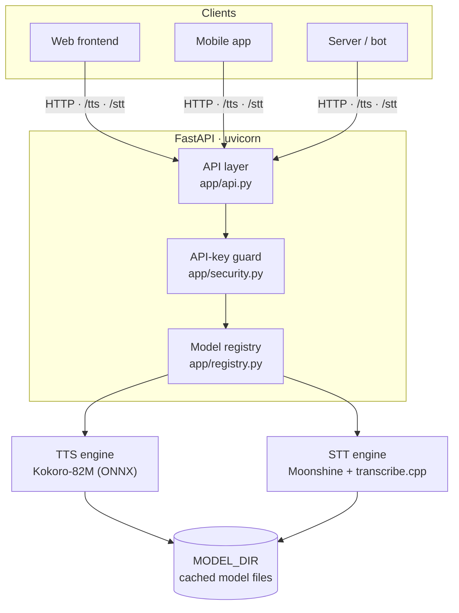
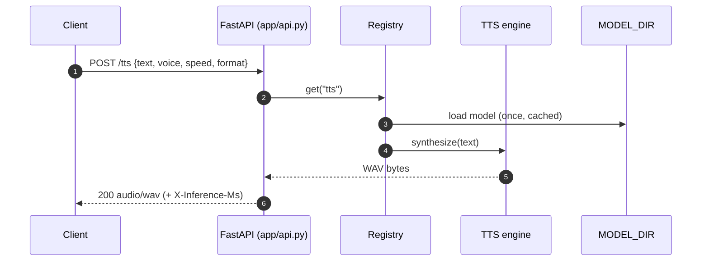
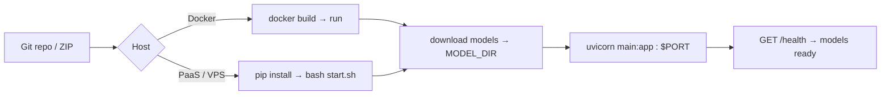

<div align="center">

# Apsides Voice API

**A reusable, production-ready HTTP voice backend — text-to-speech _and_ speech-to-text — in one FastAPI service that runs CPU-only on constrained hosts.**

[](LICENSE)
[](https://www.python.org/)
[](https://fastapi.tiangolo.com/)
[](#option-a--docker)
[](#resource-footprint)
[](scripts/verify_api.py)
[](CONTRIBUTING.md)

Maintained by **[Apsides Labs](https://github.com/apsideslabs)** — technology, products and research built with precision.

</div>

---

## Overview

Apsides Voice API exposes **one clean HTTP interface** you can connect to any number of websites and platforms. It bundles two modern small models behind two endpoints and runs entirely on CPU — **no GPU, no compiler, no system packages required.**

| Endpoint | Task | Model | Runtime |
| :--- | :--- | :--- | :--- |
| `POST /tts` | Text → Speech | **Kokoro-82M** (ONNX `model_q8f16`, ~86 MB) | `onnxruntime` (CPU) |
| `POST /stt` | Speech → Text | **Moonshine Streaming Small** Q8_0 (123M, ~189 MB GGUF) | `transcribe.cpp` (ggml CPU) |

It fits a **~2 GB RAM / 1.5 vCPU** host with **~620 MB peak RAM**, models are downloaded and cached at deploy time (never committed to git), and every setting is an environment variable.

---

## Table of Contents

- [Features](#features)
- [Architecture](#architecture)
- [Quickstart](#quickstart)
  - [Option A — Docker](#option-a--docker)
  - [Option B — Local](#option-b--local)
- [API Reference](#api-reference)
- [Configuration](#configuration)
- [Models](#models)
- [Credits & attribution](#credits--attribution)
- [Resource Footprint](#resource-footprint)
- [Deployment](#deployment)
- [Project Structure](#project-structure)
- [Troubleshooting](#troubleshooting)
- [Contributing](#contributing)
- [License](#license)

---

## Features

- 🎙️ **Two engines, one service** — Kokoro-82M TTS and Moonshine Streaming Small STT behind a single FastAPI app.
- 🖥️ **CPU-only** — no GPU, no CUDA, no accelerator dependency.
- 📦 **Zero build toolchain** — the native `libtranscribe.so` ships inside the `transcribe-cpp-native` wheel; no compiler needed.
- 🪶 **Resource-bounded** — single-threaded ONNX, a semaphore per endpoint, blocking inference pushed to a threadpool.
- 🧯 **Graceful degradation** — a missing model never stops the API booting; `/health` names the cause.
- 🔐 **Optional auth** — set `API_KEY` to require `X-API-Key` on `/tts` and `/stt` (constant-time comparison).
- 🌐 **Multi-frontend by design** — configure `CORS_ORIGINS` to allow any number of callers.
- 🧰 **Host-agnostic** — Dockerfile, `start.sh`, `Procfile` and `runtime.txt` included; only needs `$PORT` and a writable `MODEL_DIR`.
- 🔑 **No secrets in the repo** — every credential comes from the environment.

---

## Architecture



**Request lifecycle (text → speech):**



---

## Quickstart

### Option A — Docker

```bash
git clone https://github.com/apsideslabs/apsides-voice-api.git
cd apsides-voice-api

docker build -t apsides-voice-api .
docker run -p 8000:8000 -v "$PWD/models:/app/models" apsides-voice-api
```

The image downloads the models at build time, so it starts self-contained.

### Option B — Local

```bash
git clone https://github.com/apsideslabs/apsides-voice-api.git
cd apsides-voice-api
python -m venv .venv && source .venv/bin/activate
pip install -r requirements.txt

# Download models into ./models  (Kokoro ~114 MB + Moonshine GGUF ~189 MB)
python scripts/download_models.py

cp .env.example .env            # edit if you want an API key / CORS origins
uvicorn main:app --host 0.0.0.0 --port 8000
```

Open <http://localhost:8000/docs> for interactive API docs, then verify both models:

```bash
python scripts/verify_api.py
# → health OK · tts: OK · stt: OK · RESULT: PASS
```

> **ffmpeg (optional):** `soundfile` handles WAV/FLAC/OGG. Install `ffmpeg` on the host only if you want to accept MP3/WebM uploads (common from browsers' `MediaRecorder`).

---

## API Reference

| Method | Path | Body | Returns |
| :--- | :--- | :--- | :--- |
| `POST` | `/tts` | JSON `{ text, voice?, speed?, format? }` | `audio/wav` or `audio/mpeg` |
| `POST` | `/stt` | multipart `file=<audio>` (+ optional `language`) | JSON `{ text, language, duration_seconds, model }` |
| `GET` | `/health` | — | liveness + per-model state |
| `GET` | `/ready` | — | `200` once a model is loaded, else `503` |
| `GET` | `/voices` | — | available TTS voices |
| `GET` | `/docs` | — | interactive OpenAPI docs |

### Text → Speech

```bash
curl -s -X POST localhost:8000/tts \
  -H 'Content-Type: application/json' \
  -d '{"text":"Hello from Apsides.","voice":"af_heart","speed":1.0,"format":"wav"}' \
  --output speech.wav
```

### Speech → Text

```bash
curl -s -X POST localhost:8000/stt -F 'file=@recording.wav' | jq
# { "text": "hello from apsides", "language": "en", "duration_seconds": 2.31,
#   "model": "moonshine-streaming-small-q8:transcribe_cpp" }
```

### From the browser

```js
// Text → speech
const res = await fetch("https://your-api-host/tts", {
  method: "POST",
  headers: { "Content-Type": "application/json", "X-API-Key": KEY },
  body: JSON.stringify({ text: "Namaste!", voice: "af_heart" }),
});
new Audio(URL.createObjectURL(await res.blob())).play();

// Speech → text
const fd = new FormData();
fd.append("file", recordedBlob, "clip.webm"); // WAV recommended; WebM needs ffmpeg
const { text } = await (await fetch("https://your-api-host/stt", {
  method: "POST", headers: { "X-API-Key": KEY }, body: fd,
})).json();
```

---

## Configuration

All settings are environment variables — see [`.env.example`](.env.example). Key ones:

| Variable | Default | Purpose |
| :--- | :--- | :--- |
| `MODEL_DIR` | `./models` | Where models are cached — **use a persistent volume** |
| `AUTO_DOWNLOAD_MODELS` | `true` | Fetch missing models during startup |
| `PORT` / `SERVER_PORT` | `8000` | HTTP port (hosts usually inject `$PORT`) |
| `TTS_ENABLED` / `STT_ENABLED` | `true` | Enable/disable an engine (run one model to save RAM) |
| `STT_BACKEND` | `transcribe_cpp` | `transcribe_cpp` (GGUF q8_0) or `moonshine_voice` (`.ort`) |
| `ONNX_NUM_THREADS` | `1` | Keep at `1` on small vCPU hosts |
| `MAX_CONCURRENCY_TTS` / `_STT` | `1` | Simultaneous inference jobs |
| `CORS_ORIGINS` | `*` | Allowed origins (comma-separated); set explicitly in production |
| `API_KEY` | *(unset)* | If set, protects `/tts` and `/stt` via `X-API-Key` |

---

## Models

Models are **downloaded at deploy time** and cached under `MODEL_DIR` — no binaries live in git.

| Model | Role | Source | License |
| :--- | :--- | :--- | :--- |
| Kokoro-82M (`model_q8f16.onnx`) | TTS | [`onnx-community/Kokoro-82M-v1.0-ONNX`](https://huggingface.co/onnx-community/Kokoro-82M-v1.0-ONNX) | Apache-2.0 |
| Moonshine Streaming Small (Q8_0 GGUF) | STT | [`handy-computer/moonshine-streaming-small-gguf`](https://huggingface.co/handy-computer/moonshine-streaming-small-gguf) | MIT |
| transcribe.cpp runtime | STT backend | [`handy-computer/transcribe.cpp`](https://github.com/handy-computer/transcribe.cpp) | MIT |

```
<MODEL_DIR>/
├── kokoro/
│   ├── onnx/model_q8f16.onnx          ~86 MB
│   ├── voices/*.bin                   ~28 MB (54 voices)
│   └── vocab.json
└── moonshine/
    └── moonshine-streaming-small-Q8_0.gguf   ~189 MB
```

---

## Resource Footprint

Measured against a **2 GB RAM / 1.5 vCPU / 2 GB storage** host:

| Resource | Estimate | Fits? |
| :--- | :--- | :---: |
| Model files on disk | ~303 MB | ✅ |
| Python deps installed | ~308 MB | ✅ |
| **Storage total** | **~0.6 GB** (+ ~150 MB pip cache during install) | ⚠️ needs ~1 GB free |
| **RAM at runtime** | **~620 MB** peak RSS (both models loaded & run) | ✅ |
| CPU | 1–2 threads | ✅ |

> Tight on RAM? Run one engine (`TTS_ENABLED=false` or `STT_ENABLED=false`) or switch to the smaller `moonshine-streaming-tiny` GGUF (48 MB).

---

## Deployment

The service is a standard ASGI app and runs on any Python host. A full, host-by-host guide — including a concrete **Botkeep Founder Free** walkthrough and portable alternatives (Render, VPS, Docker) — lives in **[DEPLOYMENT.md](DEPLOYMENT.md)**.



**Minimum to deploy anywhere:** a public HTTP port (host injects `$PORT`) and a writable `MODEL_DIR`.

---

## Project Structure

```
apsides-voice-api/
├── main.py                       # app entrypoint (uvicorn main:app)
├── app/
│   ├── config.py                 # env-driven settings (no secrets in code)
│   ├── schemas.py                # request/response validation
│   ├── security.py               # optional X-API-Key auth
│   ├── errors.py                 # domain errors + handlers
│   ├── audio.py                  # decode (soundfile/ffmpeg) + encode (wav/mp3)
│   ├── model_download.py         # fetch + cache all model files
│   ├── registry.py               # loads engines once, reports readiness
│   ├── api.py                    # /tts, /stt, /health, /ready, /voices
│   └── engines/
│       ├── tts.py                # Kokoro ONNX engine
│       └── stt.py                # STT engines (transcribe_cpp | moonshine_voice)
├── scripts/
│   ├── download_models.py        # CLI: fetch + cache models
│   └── verify_api.py             # end-to-end smoke test against a live API
├── requirements.txt
├── requirements-moonshine.txt    # optional alternative STT backend
├── .env.example
├── start.sh                      # download-then-serve (Botkeep/Render/etc.)
├── Dockerfile / Procfile / runtime.txt
└── DEPLOYMENT.md
```

---

## Troubleshooting

| Symptom | Cause & fix |
| :--- | :--- |
| `No matching distribution found for misaki>=0.8` | You're deploying an older revision. The current `requirements.txt` no longer includes `misaki` (it needs Python <3.13). |
| `OSError: [Errno 28] No space left on device` | pip ran out of disk. Free space, clear stale pip cache, or set `STT_ENABLED=false` / use the tiny GGUF. |
| `/health` shows a model `ready: false` | `detail` names the cause (usually a failed download). Check outbound network access and that `MODEL_DIR` is writable. |
| App crashes on start | Check the last Python traceback in the log; `main.py` is the entrypoint. |
| Wrong port | The app binds `SERVER_PORT` → `PORT` → `8000`. Set `SERVER_PORT` to match your host. |

---

## Contributing

Issues and pull requests are welcome. See [CONTRIBUTING.md](CONTRIBUTING.md) for setup and guidelines.

---

## Credits & attribution

Apsides Voice API is the **service around** these models — we did not train them. All credit for the models and runtimes belongs to their creators:

| Component | Built by | License |
| :--- | :--- | :--- |
| Kokoro-82M (TTS) | **hexgrad** | Apache-2.0 |
| Kokoro ONNX packaging | **onnx-community** | Apache-2.0 |
| Moonshine Streaming Small (STT) | **Useful Sensors** (Moonshine) | MIT |
| Moonshine GGUF + transcribe.cpp | **handy-computer** | MIT |
| onnxruntime | **Microsoft** | MIT |

Our contribution is the FastAPI service, the CPU-only resource tuning, the deployment tooling and this documentation. Thanks to the maintainers above — this project would not exist without their work.

---

## License

Released under the **MIT License** — see [LICENSE](LICENSE). Model weights carry their own licenses (Kokoro-82M: Apache-2.0; Moonshine Streaming: MIT; transcribe.cpp: MIT).

---

<div align="center">

Built by **Apsides Labs** — technology, products and research built with precision.

[GitHub](https://github.com/apsideslabs) · [LinkedIn](https://www.linkedin.com/in/apsides-labs-103b07440)

</div>
